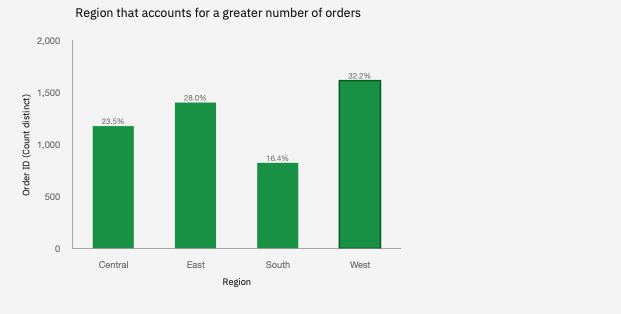
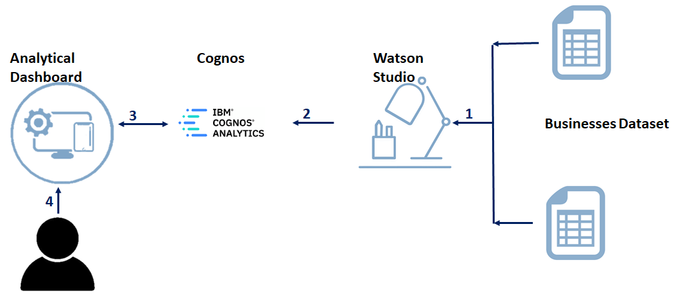

<!-- # SBSPS-Challenge-5520-Analytics-Tool-For-Ecommerce-businesses -->
# IBM Smart Bridge Hackathon 2021
# Analytics Tool For Ecommerce Businesses

The object of this challenge is to develop an Analytical Dashboard where the owner/user will understand the growth/potential of the business in the market.

Analytical Dashboard which is generated from [US Superstore data ](https://www.kaggle.com/juhi1994/superstore-analysis) contains the following statistics.

- A region that accounts for a greater number of orders

<!--    -->
- Frequency distribution of quantity ordered  
- Percentage sales by different product categories 
- Profitable products or their sub-products in the last few years 
- products  that incurred losses
- Product type that was ordered greater times 
- Yearly sales for various states
- Forecasting future sales according to shipping date.
- The trend in profit/sales over time (years/months/quarters).

# Technical Architecture

